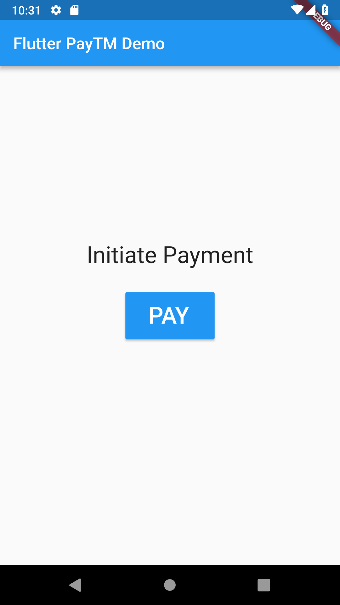
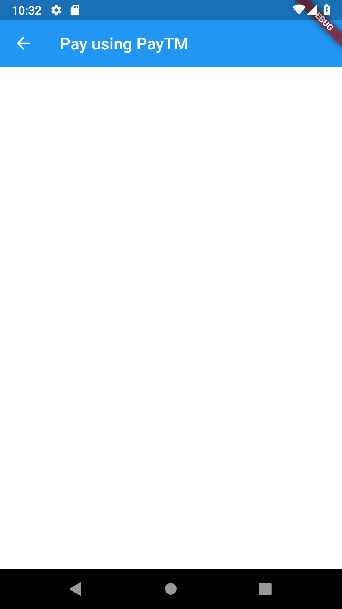
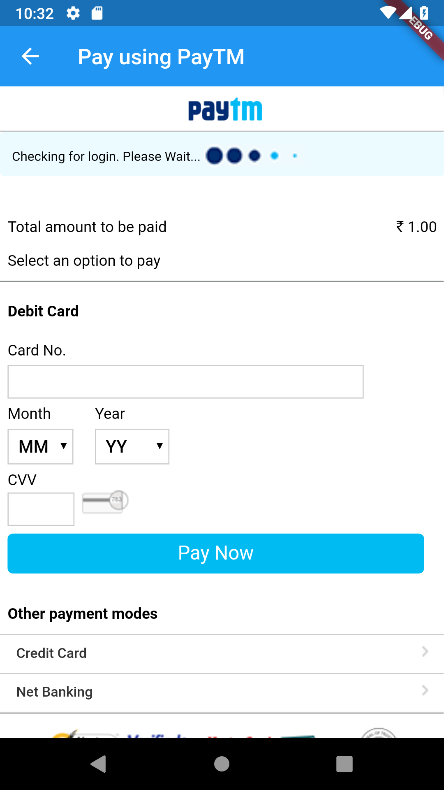
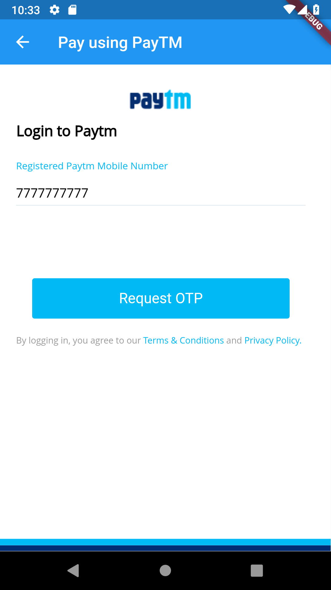
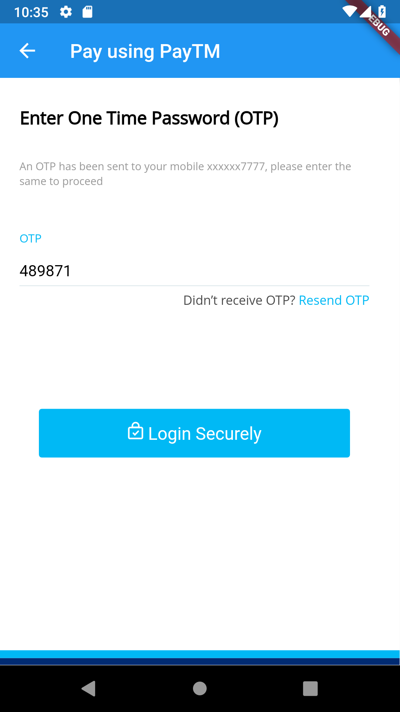
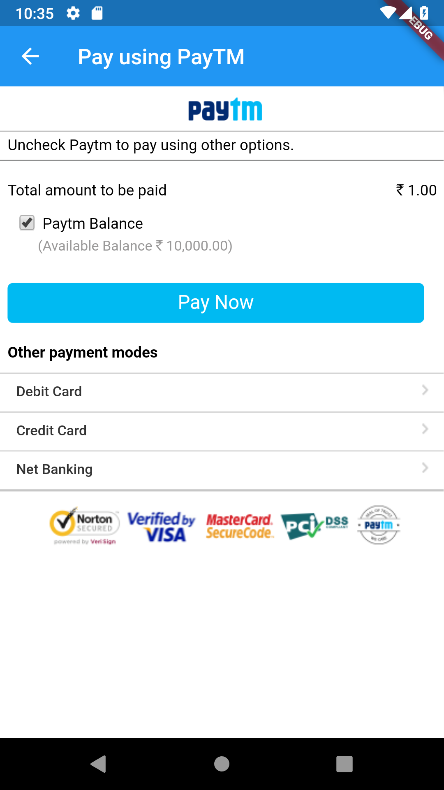
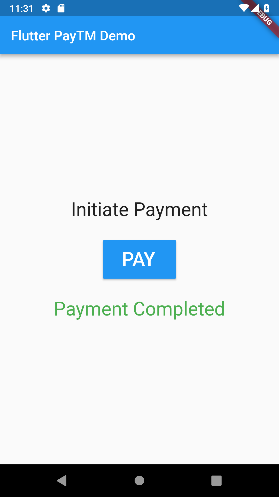

# flutter_paytm_webview

A demo flutter app for payments using paytm and node api backend

## Getting Started

### Prerequisites
- Flutter is installed
- PayTM checksum API running (https://github.com/iqans/paytm-checksum-api-nodejs)
- Android Emulator or device (optional)

### Run the application
- Update `Settings.dart` with checksum API url
- Update order/transaction information in `Paytm.dart`
- Run flutter app
`flutter run`

## Screenshots

